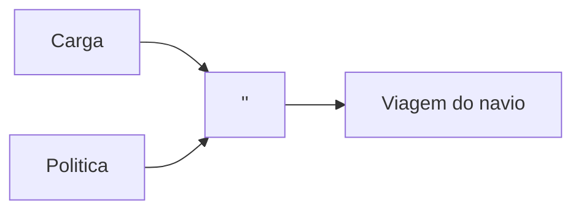

No inicio desse capitulo o autor conta uma historia de como ele (sem saber absolutamente nada de computacao de embarcados) conseguiu criar um modelo (nesse caso um diagrama) que descrevesse exatamente como ele ia tratar aquele dominio (ou seja, como ele ia resolver aquele determinado problema).

O cenario descrito se mostrou eficiente no que diz respeito a manter a comunicacao entre o time de engenharia de embarcados e ele como programador. A ideia eh que todos falassem a mesma lingua e a forma que usaram para alcancar isso foi desenhando

# Ingredientes de uma modelagem eficaz

1. Criar um modelo (representacao) a implementacao utilizada = Significa que a gente desenhou como determinado dominio (problema) seria resolvido
2. Se comunicar atraves do modelo
3. Criar um modelo baseado na regra de negocio verdadeira
4. Deixando apenas o que eh necessario no modelo (informacoes secundarias ou irrelevantes eram ocultadas)
5. Enriquecendo o modelo com ideias de terceiros

# Assimilando o conhecimento
Eh trabalho um analista modelar aquele determinado software baseado no conhecimento que ele adquiriu. Eh natural que durante uma etapa de modelagem muitas informacoes desnecessarias cheguem ate o analista, ele deve entender o que eh importante para a resolucao daquele dominio (e dominios futuros) e projetar um sistema que atenda a essas necessidades.

Antigamente o conhecimento era detido apenas pela camada de analistas, eles que acabavam apredendo como o software deveria funcionar e passava esse conhecimento para frente. Com o tempo viu-se que se faz necessario que os desenvolvedores entendam tanto do dominio quanto os analistas, dessa forma eles podem criar criar um software que foca em 2 coisas principais:

1. Organiza sua estruturacao de modo a resolver determinado problema
2. Abre possibilidade para melhorias futuras que nao vao causar grandes confusoes a nivel de codigo

_No ponto 1 eu quero dizer que o codigo vai ser escrito visando atender o dominio X, isso faz com que a lei de Conway seja melhor representada_

# Design rico em conhecimento
Nao tem como nos criarmos um design sem levar em consideracao as regras de negocio, todo nosso modelo deve ser baseado nisso. Quando representamos determinado dominio em um modelo conseguimos garantir que determinada lacuna nao ira existir quando formos transpor isso ao nosso codigo. Um outro ganho interessante que a representacao pode nos trazer eh mostrar as lacunas existentes no dominio para o especialista de dominio (hoje conhecemos essa profissao tambem como "Arquiteto de Solucao")

## Exemplo pratico
No livro o autor pede pra imaginar o seguinte cenario:

_Vamos criar um sistema que reserve espacos em um navio para transportar carga_

O modelo para nosso dominio eh o seguinte

Porem, vamos supor que esse navio queira criar a politica de overbooking (politica famosa no setor de transportes) e que essa politica devera se de 10%. Ao inves de so meter um if no codigo, o autor recomenda utilizar o modelo de organizacao **STRATEGY** (consulte a pagina 18 para visualizar o codigo). Em linhas gerais, a politica sera representada dessa forma:

As vantagens dessa abordagem sao:

1. Todo mundo vai entender o valor daquela determinada regra de negocio
2. O codigo ficara tao entendivel dessa forma que a curva de aprendizagem de qualquer pessoa nele sera bem mais rapida