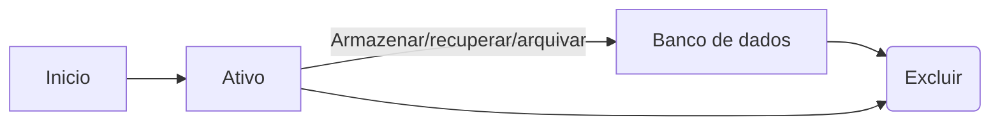
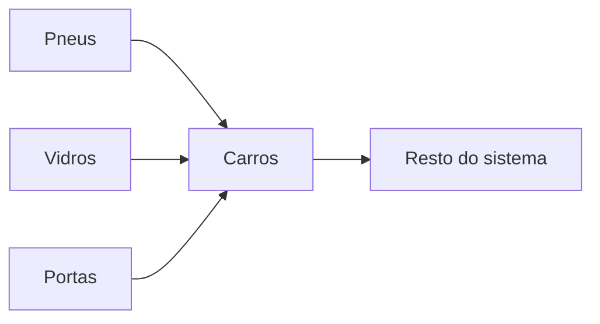

Em suma, um ciclo de vida de objetos tendem a ter o seguintes fluxos

Em linhas gerais, temos 3 mecanismos para os controles desse fluxo:

- Agregados
- Fabricas
- Repositorios

# Agregados
Agregados sao objetos filhos que ficam abaixo de um objeto pai, a esse objeto pai damos o nome de raiz, ela que ira limitar a visao dos outros objetos dentro do sistema. Na pratica funciona assim:

_CARRO_ eh uma entidade, podemos por exemplo colocar um ID no chassi e dizer que aquele carro eh unico no sistema. Pneus, vidros e portas tambem podem ser considerados entidades (desde que cada um deles tenham seus respectivos IDs), a pergunta eh: Vale a pena deixar pneus, vidros e portas sendo rastreadas no meu sistema de vendas de carro?

Pro nosso primeiro exemplo vamos assumir que nao! Logo, quando formos criar uma resolucao de dominio o principio de agregados ficaria da seguinte forma

Repare como nesse exemplo o carro entra como 2 coisas, a **raiz** de todos meus outros objetos e um **limitador** da visao deles em relacao ao "Resto do sistema".

Valido dizer tambem que nesse tipo de otica, os objetos _Pneus_, _Vidros_ e _Portas_ sao **entidades** do sistema mas eles possuem apenas identificacao local (apenas sao identificaveis para o objeto raiz, nesse caso _Carros_)

Um exemplo citado pelo autor sobre esse tipo de regra eh o seguinte:

Imagine que vamos excluir o objeto pessoa do nosso sistema. Coisas como nome, telefone, e idade podem ser excluidas normalmente, agora, e endereco?

Se excluirmos endereco, sera que tem mais alguem usando esse ponto?

Em linhas gerais: **quanto maior as relacoes entre objetos do meu sistema, mais dificil fica de delimitar seus limites**

# Fabricas
A ideia das fabricas eh ser um encapsulamento da logica complexa que eh criar um objeto. Funciona mais ou menos assim:

Imagine que temos um motor de um carro. Qual a funcao principal de um motor? Girar um eixo. Essa eh a unica funcao dele.
Para fabricarmos um motor eh sempre algo hiper complexo que dependendo do modelo pode-se encontrar projetos extremamente ambiciosos, mas no fundo ele nao deixa de ser um objeto que gira um eixo.
Colocar toda essa logica de montagem dentro de uma fabrica eh a melhor decisao que podemos tomar, dessa forma, quem compra o motor do nosso carro nao esta interessado em o quao complexo ele eh, so esta interessado em saber se ele gira um eixo.

Em modo geral, na area de software vamos seguir a seguinte regra:

Temos um objeto complexo (que detenha varias regras) ou nao vamos cria-lo dentro de fabricas. Dessa forma, quando nosso service for usar aquele determinado objeto ele nao precisa ficar se preocupando se o objeto foi criado da forma A/B/C ele so usa e pronto.

Fabricas ter um fortissimo acomplamento com o objeto que elas querem gerar, entao eh natural (e ate mesmo esperado) que sua fabrica trabalhe "especializada" em criar so um tipo de objetos. Se por ventura voce ver que 2 fabricas possuem varias semelhancas voce pode criar uma "fabrica pai" (classe abstrata) que da os insumos em comum para as "fabricas filhos" (classes herdeiras).

_E quando eu preciso criar um objeto simples? Como faco?_
Nesse caso voce ainda pode continuar utilizando fabricas, mas pode ser diretamente do construtor do seu objeto. Lembre-se, a ideia das fabricas eh facilitar o entendimento da modelagem do seu software, se voce identificar que trabalhando direto no construtor do objeto fica mais simples entao faca dessa forma, em linhas gerais **construir objetos complexos requerem fabricas mais ricas em implementacao**

# Repositorios
A ideia de repositorio (no conceito de DDD) eh a seguinte: Como vamos armazenar/recuperar determinado objeto de nosso sistema?

Em linhas gerais temos 2 formas de fazer isso:

1. Armazenando o objeto em um banco de dados
2. Fazendo o objeto A criar uma referencia ao objeto B (esse ciclo se perpetua ao infinito)

Ambos os casos tem seus pros e contras, e cabe como decisao na hora de modelar um sistema entender qual seria a melhor forma de conseguir essa informacao (baseando-se no seu contexto atual)

(O repositorio guarda as informacoes que serao usadas pela fabrica para criar determinados objetos em runtime)

No fim, essa ideia de repositorio eh a mesma que ja temos vigente hoje (2024) quando vamos estudar/usar spring boot por exemplo. Nos vamos no banco de dados e ele vai nos retornar informacoes que dentro do framework serao usadas para criarmos determinado objeto.

O unico ponto que o livro acaba batendo mais eh em relacao a **quais dados aquele determinado repositorio vai acessar**. Criar a correta divisao de quais dados serao expostos (via entidade raiz) e quais dados serao obtidos atraves da raiz (quais objetos agregados vamos obter ao pesquisar pela raiz), eh o ponto que devemos tomar cuidado ao modelar nossos sistema